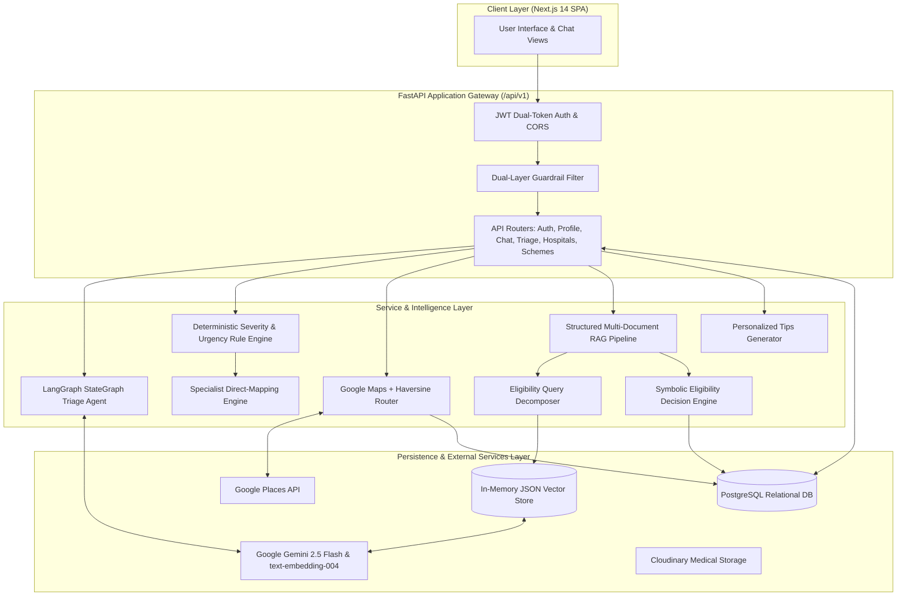
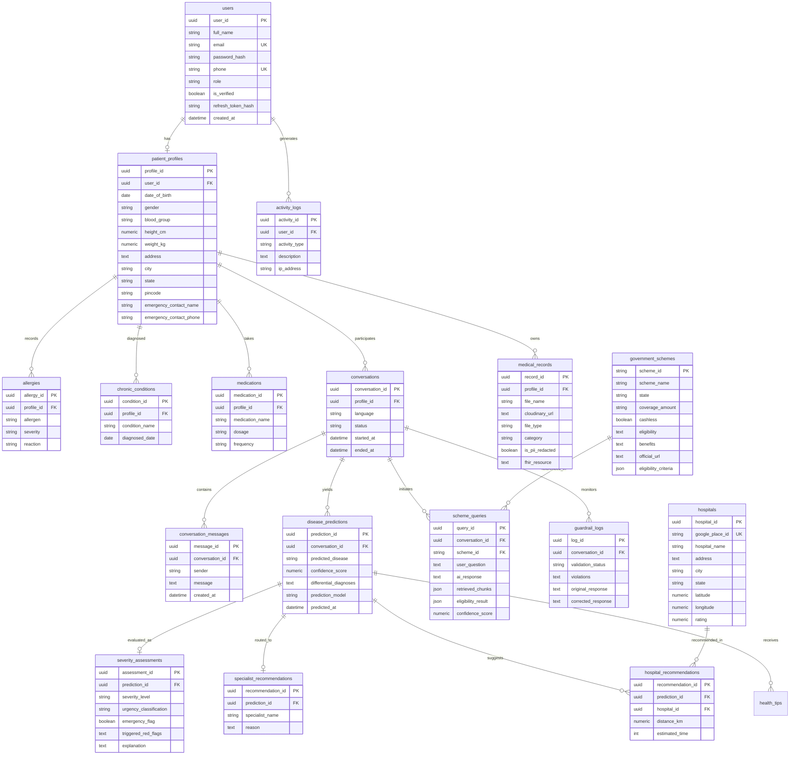

# Backend Building Plan & Architectural Blueprint
## AI-Based Healthcare Navigation and Patient Assistance System

> **Reference Standard**: All architectural choices, algorithms, and models in this building plan strictly align with the technical selections evaluated and justified in `module_techniques_justification.md` and the functional specifications in `Project_phase_1.md`.

---

## 1. Executive Summary & Architectural Overview

The **Healthcare Navigation and Patient Assistance System** is an integrated clinical-triage and health-scheme assistance platform designed to resolve healthcare fragmentation, low health literacy, and complex scheme eligibility for underserved populations.

### Core Architectural Principles
1. **Stateless API Core**: Built on **FastAPI** with asynchronous concurrency (`async`/`await`) to deliver high-throughput, low-latency API services that scale horizontally without server-side session dependencies.
2. **Dual-Path Clinical Safety (Neuro-Symbolic Design)**: Generative LLMs are used solely for natural conversation, query formulation, and human-friendly synthesis. High-stakes clinical triage (urgency, severity, red-flag detection) and scheme eligibility decisions are executed strictly by **deterministic symbolic rule engines**.
3. **Evidence-Grounded RAG (Zero-Hallucination Policy)**: Scheme queries decompose into discrete eligibility criteria, retrieving multi-document evidence from official scheme guidelines. Every claim is attributed to specific document sources, titles, and page numbers.
4. **Strict Resource Efficiency (<200MB RAM Target)**: Designed to operate on constrained server environments (e.g., free-tier cloud containers). Heavy local frameworks (PyTorch, TensorFlow, local transformer weights, Dockerized vector DBs) are replaced by API-based cloud inference and pure-Python algorithms.
5. **Resilient Fallback Design**: Every external service dependency (Google Gemini API, Google Maps API, Cloudinary) features an automated, deterministic local fallback to ensure zero system downtime.

---

### High-Level System Architecture Diagram



---

## 2. Technology Stack & Implementation Technique Matrix

The table below summarizes every backend module, the exact implementation technique selected from `module_techniques_justification.md`, and its core technical justification.

| Module # | Backend Module | Selected Implementation Technique | Key Architectural Justification |
|---|---|---|---|
| **M1** | User Authentication | **Stateless JWT Dual-Token (HS256) + bcrypt** | Completely stateless for horizontal scalability; bcrypt requires only ~4KB RAM per hash compared to Argon2id (~64MB). |
| **M2** | Patient Profile Management | **PostgreSQL Relational Schema with SQLAlchemy Async** | Structured 1:1 and 1:N relations for medical history, allergies, chronic conditions, and medications. Full ACID integrity. |
| **M3** | Patient Context Management | **Aggregated Context Injector (SQLAlchemy eager loads)** | Seamlessly loads patient demographic and clinical history into triage prompts without session bloat. |
| **M4** | Conversational Symptom Intake | **Gemini 2.5 Flash via LangGraph StateGraph (Temp 0.1)** | Explicit typed graph state (`AgentState`); 10–15x cheaper than GPT-4o; near-deterministic clinical data capture. |
| **M5** | Structured Symptom Assessment | **Pydantic Validation & Normalization Engine** | Converts unstructured conversation transcripts into standardized clinical symptom dictionaries. |
| **M6** | Severity & Urgency Assessment | **Deterministic Rule-Based Engine (70/30 Weighted Formula)** | 100% reproducible, zero-hallucination, literature-grounded triage. Executes in <1ms without heavy ML dependencies. |
| **M7** | Specialist Recommendation | **Direct Disease-to-Specialist Rule Mapping (O(1) Lookup)** | Deterministic outcome of disease triage; eliminates hallucinated specialties with a General Physician fallback. |
| **M8** | Nearby Hospital Discovery | **Google Maps Places API + Pure-Python Haversine Formula** | Unmatched POI coverage across Indian urban & rural tiers; Haversine eliminates expensive matrix API calls with <0.3% error. |
| **M9** | Government Scheme Knowledge Base | **Document Parser, Semantic Chunking & Schema Metadata** | Curated official PM-JAY and state guidelines parsed into semantic sections with source and page attribution. |
| **M10** | Vector Embeddings & Store | **Google `text-embedding-004` + Pure-Python JSON Vector Store** | Zero PyTorch/transformers RAM overhead (~0MB local); brute-force cosine search executes in <5ms for <500 chunks with 100% exact recall. |
| **M11** | Eligibility Query Decomposition | **Multi-Criteria Symbolic Decomposer** | Breaks user questions into 5 discrete criteria (Age, Income, State, Beneficiary Category, Medical Condition). |
| **M12** | Evidence Filtering & Multi-Doc Retrieval | **Scoped Multi-Chunk Retriever with Relevance Thresholding** | Pulls top-$K$ chunks across disparate scheme documents; filters sub-threshold noise before reasoning. |
| **M13** | Multi-Document Eligibility Decision | **Deterministic 4-Way Symbolic Decision Engine** | Evaluates criteria into `PASS`, `FAIL`, or `UNKNOWN`; synthesizes `ELIGIBLE`, `NOT_ELIGIBLE`, `POSSIBLY_ELIGIBLE`, or `INSUFFICIENT_INFORMATION`. |
| **M14** | Source-Grounded Eligibility Response | **Grounded Gemini 2.5 Flash (Temp 0.2) with Strict Citations** | Enforces "use retrieved context only"; returns explicit document titles, page numbers, and chunk IDs. |
| **M15** | AI Guardrails & Safety Layer | **Dual-Layer Guardrail (Keyword Blocklist + Gemini Classifier)** | <1ms fast rejection of non-medical prompts; semantic LLM safety check handles prompt injection and boundary testing. |
| **M16** | Consultation & History API | **Relational Session & Snapshot Tracker** | Persists conversation history, structured symptoms, predictions, hospital recommendations, and scheme results. |
| **M17** | Patient Dashboard API | **Consolidated Asynchronous Aggregator Service** | Single-roundtrip payload delivery for user dashboard, recent consultations, active schemes, and quick actions. |
| **M18** | Health & Wellness Tips Engine | **Personalized Gemini 2.5 Flash + Curated Static Fallback** | Generates non-diagnostic lifestyle and preventive tips tailored to patient age/chronic conditions with safe offline fallback. |
| **M19** | Document Storage & Interoperability | **Cloudinary CDN + HL7 FHIR R4 DocumentReference Formatter** | Off-server secure storage for eligibility certificates and lab reports; standardizes exports to FHIR R4 specification. |
| **M20** | Activity Logging & System Auditing | **Async Audit Logging Engine (`activity_logs` & `guardrail_logs`)** | Non-blocking database recording of security events, triage actions, and system integrity logs. |
| **M21** | Database Engine & Migration Manager | **PostgreSQL (asyncpg) + Alembic Migrations (SQLite Dev Fallback)** | Production-grade async pooling, schema migration tracking, and local development zero-setup support. |

---

## 3. Module-Wise Detailed Building Plan

---

### Module 1: User Authentication & Authorization API
- **Objective**: Provide secure, stateless user registration, authentication, token rotation, and password management.
- **Implementation Technique**: Stateless JWT Dual-Token (Short-lived Access Token: 15 min + Long-lived Refresh Token: 7 days) signed with HMAC-SHA256 (`HS256`). Password hashing using `bcrypt` (12 rounds).
- **Justification**:
  - Stateless architecture allows deployment across serverless/container platforms without a shared Redis session store.
  - `bcrypt` utilizes ~4KB memory per hash, preserving the system's strict <200MB RAM budget (unlike Argon2id which consumes ~64MB per operation).
- **Backend Components**:
  - `backend/app/core/security.py`: Token creation, signature verification, bcrypt hashing.
  - `backend/app/api/v1/auth.py`: `/register`, `/login`, `/refresh`, `/forgot-password`, `/reset-password`, `/me`.
  - `backend/app/services/auth_service.py`: Authentication business logic and token hash storage.
  - `backend/app/schemas/auth.py`: Pydantic request/response validation.
  - `backend/app/models/user.py`: `User` SQLAlchemy model.
- **Workflow**:
  1. User submits `UserCreate` (email, password, full_name, phone).
  2. Service checks uniqueness, hashes password with `bcrypt.hashpw()`, generates UUID, and commits record.
  3. On `/login`, passwords are verified via `bcrypt.checkpw()`.
  4. System issues Access Token (`sub`: user_id, `exp`: +15m) and Refresh Token (`sub`: user_id, `exp`: +7d). The refresh token's SHA-256 hash is recorded in `users.refresh_token_hash`.
  5. On `/refresh`, hash of incoming refresh token is verified against the database before rotating tokens.

---

### Module 2: Patient Profile & Demographics Management API
- **Objective**: Manage comprehensive patient demographic and clinical baseline data.
- **Implementation Technique**: Normalized PostgreSQL Relational Schema with SQLAlchemy Async ORM.
- **Justification**:
  - Direct 1:1 relation between `users` and `patient_profiles`.
  - 1:N relations for `allergies`, `chronic_conditions`, and `medications` maintain referential integrity with cascading deletes.
- **Backend Components**:
  - `backend/app/models/profile.py`: `PatientProfile`, `Allergy`, `ChronicCondition`, `Medication`.
  - `backend/app/api/v1/profile.py`: Profile GET, PUT, and sub-entity CRUD endpoints.
  - `backend/app/services/profile_service.py`: Profile aggregation and atomic transaction handling.
  - `backend/app/schemas/profile.py`: `PatientProfileCreate`, `PatientProfileUpdate`, `PatientProfileResponse`.
- **Workflow**:
  1. Profile is created automatically upon user registration or populated via `/api/v1/profile`.
  2. Stores personal demographics (DOB, gender, blood group, height, weight, address, state, emergency contact).
  3. Supports discrete management of allergies (substance, severity, reaction), chronic conditions (condition name, diagnosed date), and active medications (name, dosage, frequency).

---

### Module 3: Patient Context Management Engine
- **Objective**: Assemble comprehensive patient context to feed into conversational symptom intake, severity classification, and scheme eligibility checks.
- **Implementation Technique**: Asynchronous Database Context Assembler using SQLAlchemy joined eager loading.
- **Justification**:
  - Eliminates the N+1 query problem by loading patient profile, chronic conditions, active medications, and recent consultation summaries in a single asynchronous SQL query.
- **Backend Components**:
  - `backend/app/services/profile_service.py` -> `get_patient_context(user_id)`.
  - Injected directly into `backend/app/agents/graph.py` and `backend/app/rag/pipeline.py`.
- **Workflow**:
  1. Engine loads user demographic baseline (Age, Gender, State).
  2. Compiles list of active chronic diseases (e.g., Hypertension, Type-2 Diabetes) and medications.
  3. Formats clinical context into a concise prompt prefix for Gemini 2.5 Flash to ensure context-aware follow-up questioning.

---

### Module 4: Conversational Symptom Intake Agent
- **Objective**: Conduct structured, multi-turn clinical symptom intake dialogues with patients to collect granular symptom parameters (onset, duration, severity, radiation, aggravating factors).
- **Implementation Technique**: **Google Gemini 2.5 Flash** orchestrated via **LangGraph StateGraph** (`temperature: 0.1`).
- **Justification**:
  - Captures 3–5x more clinical details than static single-shot checkboxes.
  - **LangGraph** provides deterministic execution edges with an auditable, typed state dictionary (`AgentState`), avoiding unpredictable open-loop ReAct autonomous agent behavior.
  - **Gemini 2.5 Flash** provides high medical reasoning at ~$0.15/1M input tokens, using the same unified Google API key as embeddings and Maps.
  - Low temperature (0.1) enforces clinical consistency and prevents hallucination.
- **Backend Components**:
  - `backend/app/agents/graph.py`: LangGraph `StateGraph`, node definitions (`triage_node`), compilation.
  - `backend/app/agents/triage_agent.py`: Gemini prompt construction, message formatting, and response parser.
  - `backend/app/api/v1/conversations.py`: Message dispatch, stream handling, and state persistence.
- **Workflow**:
  1. Patient posts message to `/api/v1/conversations/{id}/messages`.
  2. LangGraph loads message history and patient context.
  3. Gemini 2.5 Flash evaluates if the symptom picture is complete or if urgent red flags exist.
  4. Returns structured JSON: `needs_more_info` (boolean), `question` (follow-up question), `options` (quick replies), `symptoms` (extracted symptom list), and `is_emergency` (boolean).
  5. If `needs_more_info` is `False`, symptom intake concludes and triggers Module 5 & 6.

---

### Module 5: Structured Symptom Assessment & Extraction Engine
- **Objective**: Normalize conversational symptom entities into standardized clinical representations for rule processing.
- **Implementation Technique**: Pydantic Schema Parsing and Lowercase Keyword Vectorizer.
- **Justification**:
  - Decouples LLM natural language variance from downstream rule processing.
  - Maps conversational phrases (e.g., "tightness in chest", "left arm tingling") to canonical clinical tokens.
- **Backend Components**:
  - `backend/app/schemas/conversation.py`: `SymptomExtractionResult`.
  - `backend/app/ml/rule_based_predictor.py`: `_normalize_symptoms()`.
- **Workflow**:
  1. Extracts primary symptoms, associated symptoms, duration, onset, and severity tags.
  2. Formats symptoms into a normalized token set (e.g., `["chest_pain", "left_arm_radiation", "shortness_of_breath"]`).
  3. Passes normalized tokens to the Severity & Urgency Rule Engine.

---

### Module 6: Severity & Urgency Assessment Engine
- **Objective**: Perform deterministic clinical triage and urgency classification without relying on black-box probabilistic models.
- **Implementation Technique**: **Deterministic Rule-Based Clinical Engine** with a **70/30 Weighted Confidence Formula**:
  $$\text{Confidence} = \left(\frac{\text{matched\_required}}{\text{total\_required}} \times 0.70\right) + \left(\frac{\text{matched\_supporting}}{\text{total\_supporting}} \times 0.30\right)$$
- **Justification**:
  - In healthcare triage, a missed emergency is catastrophic. **Determinism is non-negotiable**—identical symptoms must yield identical urgency ratings on every run.
  - Zero dependencies (no scikit-learn, PyTorch, or XGBoost libraries required, saving ~800MB disk/memory).
  - 100% auditable: clinicians can inspect every rule directly.
  - Sub-millisecond execution (<1ms).
- **Clinical Urgency Hierarchy**:
  1. `EMERGENCY`: Immediate ER or ambulance required (e.g., Acute Coronary Syndrome, Stroke, Anaphylaxis).
  2. `URGENT`: Same-day clinical consultation required (e.g., Acute Appendicitis, Severe Asthma Exacerbation).
  3. `NON_URGENT`: Schedule clinic appointment within 24–48 hours (e.g., Acute Bronchitis, Migraine).
  4. `ROUTINE`: General primary care, rest, or self-care guidance (e.g., Tension Headache, Viral Upper Respiratory Infection).
- **Backend Components**:
  - `backend/app/ml/rule_based_predictor.py`: `RuleBasedPredictor`, `DISEASE_RULES` dictionary containing 12 validated clinical categories.
  - `backend/app/services/prediction_service.py`: Orchestrates prediction persistence and response formatting.
  - `backend/app/models/prediction.py`: `DiseasePrediction`, `SeverityAssessment`.
- **Workflow**:
  1. Receives normalized symptom list.
  2. Evaluates symptom tokens against all clinical disease rules.
  3. Calculates required and supporting symptom match ratios.
  4. Ranks candidate conditions by confidence score.
  5. Assigns highest urgency level, identifies triggered red flags, and logs the clinical rationale.

---

### Module 7: Medical Specialist Recommendation Engine
- **Objective**: Map the triaged clinical condition and urgency level to the most appropriate medical specialist.
- **Implementation Technique**: Direct Disease-to-Specialist Rule Mapping ($O(1)$ lookup) with General Physician Fallback.
- **Justification**:
  - Specialist recommendation is a direct clinical derivative of disease triage. Adding an LLM or ML model introduces unnecessary failure modes and non-existent specialty hallucinations.
- **Backend Components**:
  - `backend/app/ml/rule_based_predictor.py`: Integrated `specialist` attribute within `DISEASE_RULES`.
  - `backend/app/agents/specialist_agent.py`: Specialist recommendation formatter.
  - `backend/app/models/prediction.py`: `SpecialistRecommendation`.
- **Workflow**:
  1. Retrieves top predicted condition from Module 6.
  2. Looks up corresponding specialist (e.g., "Acute Coronary Syndrome" $\rightarrow$ "Cardiologist (Emergency)", "Appendicitis" $\rightarrow$ "General Surgeon", "Asthma" $\rightarrow$ "Pulmonologist").
  3. If no condition reaches the minimum confidence threshold ($<0.30$), falls back safely to "General Physician".
  4. Stores recommendation in `specialist_recommendations` table.

---

### Module 8: Nearby Hospital Discovery & Geospatial Router
- **Objective**: Discover and rank nearby healthcare facilities relevant to the patient's location and recommended medical specialty.
- **Implementation Technique**: **Google Maps Places API** + **Pure-Python Haversine Distance Formula** + Local Database Caching.
  - **Haversine Formula**:
    $$d = 2R \cdot \arcsin\left(\sqrt{\sin^2\left(\frac{\Delta \phi}{2}\right) + \cos(\phi_1)\cos(\phi_2)\sin^2\left(\frac{\Delta \lambda}{2}\right)}\right)$$
  - **Drive Time Heuristic**: $\text{Estimated Time} = \max\left(2, \lfloor\text{distance\_km} \times 2.5\rfloor\right)\text{ minutes}$
- **Justification**:
  - Google Places API provides the highest healthcare POI coverage in India, spanning metropolitan and Tier-2/Tier-3 rural centers.
  - Haversine formula calculation in pure Python incurs <0.3% error compared to geodesic ellipsoids, executing in $O(1)$ time with zero external GIS dependencies.
  - Avoids per-query Google Distance Matrix API charges by calculating road travel via empirical urban traffic heuristics.
  - Caching places in the local `hospitals` table avoids duplicate Google Places API calls.
  - Fully offline mock fallback ensures seamless development without requiring active API keys.
- **Backend Components**:
  - `backend/app/utils/maps.py`: `GoogleMapsService`, `haversine_distance()`, and Indian healthcare facility mock database.
  - `backend/app/services/hospital_service.py`: Cache lookup, distance filtering, and recommendation linking.
  - `backend/app/api/v1/hospitals.py`: `/nearby`, `/search`, `/{hospital_id}`.
  - `backend/app/models/hospital.py`: `Hospital`, `HospitalRecommendation`.
- **Workflow**:
  1. Client sends latitude, longitude, and optional specialty filter to `/api/v1/hospitals/nearby`.
  2. Service queries Google Places API for `type="hospital"` within a specified radius (default 10 km).
  3. Calculates Haversine distance and estimated drive time for each facility.
  4. Sorts facilities by distance, caches details in `hospitals` table, and returns sorted facility list.

---

### Module 9: Government Scheme Knowledge Base & Document Preprocessing
- **Objective**: Curate, clean, chunk, and index official government healthcare schemes (e.g., Ayushman Bharat PM-JAY, State Government Schemes) for high-precision retrieval.
- **Implementation Technique**: Semantic Document Chunking with Preserved Metadata Headers.
- **Justification**:
  - Splitting scheme documents into coherent eligibility, benefits, empanelment, and exclusions chunks preserves the structural logic necessary for multi-criteria reasoning.
- **Backend Components**:
  - `backend/healthcare_schemes.json`: Master scheme dataset containing official guidelines, eligibility criteria, benefits, coverage amounts, and official URLs.
  - `backend/scripts/seed_schemes.py`: Ingestion script converting scheme JSON into database records and vector store chunks.
  - `backend/app/models/scheme.py`: `GovernmentScheme` model.
- **Workflow**:
  1. On system startup, `lifespan` verifies `government_schemes` table populated.
  2. Parses each scheme document into discrete semantic sections: Eligibility, Covered Procedures, Exclusions, and Claim Process.
  3. Attaches rich metadata (Scheme ID, Scheme Name, Section Type, State, Official URL, Source Document Title).

---

### Module 10: RAG Vector Embeddings & In-Memory Vector Store
- **Objective**: Generate semantic vector representations and perform real-time nearest-neighbor retrieval over government scheme guidelines.
- **Implementation Technique**: **Google `text-embedding-004` (768 dimensions)** + **Pure-Python In-Memory JSON Vector Store** (Brute-Force Cosine Similarity).
  - **Cosine Similarity Formula**:
    $$\text{Cosine Similarity}(A, B) = \frac{A \cdot B}{\|A\|_2 \|B\|_2} = \frac{\sum_{i=1}^n A_i B_i}{\sqrt{\sum_{i=1}^n A_i^2} \sqrt{\sum_{i=1}^n B_i^2}}$$
- **Justification**:
  - **Google `text-embedding-004`**: 768 dimensions via API call; zero local RAM footprint. Running Sentence-Transformers locally would consume ~1.1GB RAM—violating our 200MB target.
  - **Pure-Python JSON Store**: The scheme corpus consists of ~20 schemes (~100–500 chunks). On 500 vectors, brute-force cosine similarity executes in **<5ms** in pure Python.
  - **Exact Search**: At <500 vectors, brute-force is **more accurate** than Approximate Nearest Neighbor (ANN) indexers (ChromaDB, FAISS) which sacrifice precision for scale.
  - Eliminates heavy C++ / Docker dependencies (no ChromaDB, FAISS, or Qdrant).
  - Deterministic MD5 pseudo-embedding fallback operates when no Google API key is provided.
- **Backend Components**:
  - `backend/app/rag/embeddings.py`: `EmbeddingService`, Google Generative AI embeddings integration, pure-Python MD5 fallback.
  - `backend/app/rag/vectorstore.py`: `VectorStore`, pure-Python vector math, JSON persistence.
  - `backend/app/rag/vector_store/vector_store.json`: Serialized vector index.
- **Workflow**:
  1. `EmbeddingService.get_embedding(text)` converts text into a 768-dimensional normalized float array.
  2. `VectorStore.similarity_search(query_emb, k=4)` computes dot products across stored chunk embeddings in memory.
  3. Returns top-$K$ chunks with similarity scores and complete metadata.

---

### Module 11: Eligibility Query Decomposition Engine
- **Objective**: Decompose unstructured user scheme queries into discrete eligibility evaluation criteria.
- **Implementation Technique**: Multi-Criteria Symbolic Query Decomposer.
- **Justification**:
  - Standard naive RAG fails on government schemes because a single query (e.g., "Can I get free heart surgery under PM-JAY?") combines age, income, geographic residence, beneficiary category, and clinical necessity.
  - Decomposing the query into discrete sub-questions ensures all criteria are independently retrieved and evaluated.
- **Targeted Evaluation Criteria**:
  1. **Age / Demographic Criteria**: Beneficiary age constraints (e.g., senior citizen top-ups).
  2. **Economic / Income Criteria**: Below Poverty Line (BPL), SECC 2011, ration card criteria.
  3. **Geographic / State Criteria**: State of domicile and empanelled hospital location.
  4. **Beneficiary Category**: Priority households, RSBY cardholders, vulnerable tribal groups.
  5. **Medical Condition / Clinical Necessity**: Whether the requested procedure or disease is included or listed under exclusions.
- **Backend Components**:
  - `backend/app/rag/pipeline.py`: Query parser and criterion decomposer.
- **Workflow**:
  1. Accepts user query and patient profile context.
  2. Deconstructs the inquiry into criterion-level evaluation targets.
  3. Generates targeted semantic search queries for each criterion.

---

### Module 12: Evidence Filtering & Multi-Document Retrieval
- **Objective**: Retrieve and filter relevant evidence chunks across multiple government scheme documents.
- **Implementation Technique**: Scoped Semantic Retrieval with Relevance Score Filtering.
- **Justification**:
  - Multi-document retrieval prevents cross-scheme hallucinations and ensures retrieved guidelines strictly apply to the queried program.
- **Backend Components**:
  - `backend/app/rag/pipeline.py`: Evidence aggregator and filter.
- **Workflow**:
  1. Retrieves top-$K$ candidate chunks from the `VectorStore`.
  2. If a specific `scheme_id` is scoped, filters results to chunks belonging to that scheme.
  3. Filters chunks below a cosine similarity relevance threshold ($<0.50$).
  4. Formats each chunk with citation metadata (Chunk ID, Document Title, Page Reference, Official URL).

---

### Module 13: Multi-Document Eligibility Reasoning & Decision Engine
- **Objective**: Compare user demographic and medical data against retrieved scheme criteria to evaluate eligibility deterministically.
- **Implementation Technique**: **Symbolic Criterion-Level Decision Engine** yielding a **4-Way Status Classification**:
  - `ELIGIBLE`: All required criteria confirmed satisfied (`PASS`).
  - `NOT_ELIGIBLE`: At least one disqualifying exclusion or failed condition (`FAIL`).
  - `POSSIBLY_ELIGIBLE`: Key criteria met, but some conditional requirements require official verification.
  - `INSUFFICIENT_INFORMATION`: Missing critical information (e.g., unknown income or unstated state) needed to evaluate criteria (`UNKNOWN`).
- **Justification**:
  - Directly eliminates the research gap where naive RAG forces false binary decisions.
  - Explicitly flags what information is missing, prompting the user for specific details.
- **Backend Components**:
  - `backend/app/rag/pipeline.py`: `_evaluate_eligibility()`, criteria evaluator, exclusions analyzer.
- **Workflow**:
  1. Checks for non-covered elective/cosmetic procedures (e.g., cosmetic surgery, private spa) $\rightarrow$ marks `NOT_ELIGIBLE`.
  2. Evaluates each extracted criterion against patient profile data:
     - Criterion matches profile data $\rightarrow$ `status: "PASS"`.
     - Profile contradicts requirement $\rightarrow$ `status: "FAIL"`.
     - Profile lacks necessary field $\rightarrow$ `status: "UNKNOWN"`.
  3. Synthesizes criterion-level decisions into overall eligibility status with actionable next steps.

---

### Module 14: Source-Grounded Eligibility Response Generator
- **Objective**: Synthesize retrieved scheme evidence into clear, understandable language with strict citation attribution.
- **Implementation Technique**: Grounded **Gemini 2.5 Flash** (`temperature: 0.2`) with Strict Source Citation Enforcement.
- **Justification**:
  - Using a system prompt that strictly forbids answering beyond provided context prevents parametric model hallucinations.
  - Low temperature (0.2) balances readable phrasing with factual grounding.
- **Backend Components**:
  - `backend/app/rag/pipeline.py`: Grounded prompt template and synthesis chain.
  - `backend/app/api/v1/schemes.py`: `/query`, `/eligible`, `/all`.
  - `backend/app/models/scheme.py`: `SchemeQuery`.
- **Workflow**:
  1. Assembles retrieved evidence chunks into a formatted context block.
  2. Prompts Gemini 2.5 Flash with strict grounding instructions:
     `"ONLY answer using the provided context excerpts. If the information is not in the text, state that it is unavailable."`
  3. Attaches `evidence_sources` array detailing `chunk_id`, `document_title`, `page_number`, `excerpt`, and `official_url`.
  4. Calculates overall confidence score and sets `is_low_confidence` flag if top score $<0.65$.
  5. Commits query, response, and evidence snapshot into `scheme_queries` table.

---

### Module 15: AI Guardrails & Clinical Safety Layer
- **Objective**: Intercept and filter adversarial prompts, off-topic requests (e.g., programming, creative writing), and potentially unsafe clinical advice.
- **Implementation Technique**: **Dual-Layer Guardrail**:
  1. **Layer 1 (Fast-Path)**: Pure-Python local keyword blocklist (<1ms latency, 0 cost).
  2. **Layer 2 (Semantic Check)**: Gemini 2.5 Flash JSON safety classification for ambiguous prompts.
- **Justification**:
  - Rejects 90%+ of off-topic queries immediately without invoking LLM API calls, preserving latency and API quota.
  - The second layer catches complex prompt injections and adversarial jailbreaks.
- **Backend Components**:
  - `backend/app/agents/guardrail_agent.py`: `GuardrailAgent.validate_query()`.
  - `backend/app/api/v1/guardrails.py`: `/validate`.
  - `backend/app/models/audit.py`: `GuardrailLog`.
- **Workflow**:
  1. Query is tested against non-medical keyword list (e.g., `write code`, `poem`, `math`, `recipe`).
  2. If matched, immediately returns `validation_status: "failed"` with a standardized polite medical redirect.
  3. If passed, evaluates prompt via Gemini safety classifier with structured JSON output: `{"validation_status": "passed"|"failed", "violations": ...}`.
  4. Logs violations and corrections into `guardrail_logs` table for clinical audit.

---

### Module 16: Consultation & History Management API
- **Objective**: Provide structured, longitudinal tracking of patient consultations, symptoms, diagnoses, recommendations, and scheme inquiries.
- **Implementation Technique**: Relational Session & Cascade-Linked Consultation Store.
- **Justification**:
  - Maintains a complete, auditable clinical timeline for each patient. Enables physicians or patients to review prior triage sessions and track symptom evolution.
- **Backend Components**:
  - `backend/app/api/v1/history.py`: `/history`, `/history/{id}`.
  - `backend/app/api/v1/conversations.py`: Consultation session lifecycle.
  - `backend/app/models/conversation.py`: `Conversation`, `ConversationMessage`.
  - `backend/app/models/prediction.py`: `DiseasePrediction`, `SeverityAssessment`, `SpecialistRecommendation`.
- **Workflow**:
  1. Initiates conversation session on `/api/v1/conversations`.
  2. Logs every message with sender (`user` | `assistant`) and timestamp.
  3. At triage conclusion, attaches `disease_predictions`, `severity_assessments`, and `hospital_recommendations` directly to `conversation_id`.
  4. Endpoint `/api/v1/history` returns chronologically sorted consultation history with full clinical details.

---

### Module 17: Patient Dashboard & Analytics Aggregator API
- **Objective**: Deliver a unified, consolidated dashboard payload containing patient profile metrics, latest triage status, recent consultations, and eligible schemes.
- **Implementation Technique**: Consolidated Asynchronous Service Aggregator.
- **Justification**:
  - Eliminates frontend waterfall requests by providing an all-in-one summary in a single HTTP roundtrip.
- **Backend Components**:
  - `backend/app/api/v1/dashboard.py`: `/summary`.
  - Aggregates data from `profile_service`, `conversation_service`, `prediction_service`, and `scheme_service`.
- **Workflow**:
  1. Authenticated user calls `/api/v1/dashboard/summary`.
  2. Concurrently retrieves:
     - Profile completion status and biometric stats (BMI, Blood Group).
     - Most recent severity assessment & recommended specialist.
     - Nearest recommended hospital.
     - Top recommended government healthcare schemes.
     - Recent consultation activity.
  3. Formats response into a structured dashboard payload.

---

### Module 18: Personalized Healthcare & Wellness Tips Engine
- **Objective**: Provide personalized, preventive healthcare and lifestyle tips based on patient demographics and chronic conditions.
- **Implementation Technique**: **Gemini 2.5 Flash** with **Curated Clinical Static Fallback**.
- **Justification**:
  - Prompt explicitly enforces general wellness and preventive guidance only—strictly forbidding definitive medical diagnosis or drug prescriptions.
  - Curated static fallback ensures the patient always receives high-quality guidance even when offline or without API credits.
- **Backend Components**:
  - `backend/app/agents/tips_agent.py`: `generate_health_tips()`, wellness prompt templates, static category fallback database.
  - `backend/app/services/tips_service.py`: Context assembly and caching.
  - `backend/app/api/v1/tips.py`: `/daily`, `/condition/{condition_name}`.
  - `backend/app/models/prediction.py`: `HealthTip`.
- **Workflow**:
  1. Accepts patient age, gender, chronic conditions, and current symptoms.
  2. Queries Gemini 2.5 Flash for 3–5 practical, preventive lifestyle recommendations.
  3. If API is unavailable, selects verified evidence-based tips from local static repository.
  4. Attaches disclaimer: *"For informational purposes only; consult a healthcare professional for diagnosis and treatment."*

---

### Module 19: Document Storage & FHIR Interoperability API
- **Objective**: Securely store patient medical records (prescriptions, lab reports, income/eligibility certificates) and format records according to healthcare data standards.
- **Implementation Technique**: **Cloudinary Secure CDN** + **HL7 FHIR R4 DocumentReference Formatter**.
- **Justification**:
  - Offloads heavy binary file storage to Cloudinary, keeping the backend stateless and within storage limits.
  - Includes a PII redaction tracking flag.
  - Converts medical records into HL7 FHIR R4 `DocumentReference` JSON bundles, ensuring interoperability with national healthcare platforms (e.g., Ayushman Bharat Digital Mission - ABDM).
- **Backend Components**:
  - `backend/app/utils/cloudinary.py`: `CloudinaryService` for upload, URL generation, and secure asset deletion.
  - `backend/app/fhir/formatter.py`: `FHIRFormatter` converting internal records to FHIR R4 resources.
  - `backend/app/api/v1/records.py`: Record upload, download URL generation, FHIR export.
  - `backend/app/models/record.py`: `MedicalRecord`.
- **Workflow**:
  1. Patient uploads medical PDF or image via `/api/v1/records/upload`.
  2. File is uploaded to Cloudinary in a designated secure folder.
  3. Record is cataloged with file metadata, category, and PII status.
  4. Generates standard HL7 FHIR R4 `DocumentReference` JSON stored in `medical_records.fhir_resource`.

---

### Module 20: System Auditing, Activity Logging & Security Monitoring
- **Objective**: Track and audit all security, authentication, and clinical decision events across the platform.
- **Implementation Technique**: Asynchronous Event Audit Logger (`activity_logs` & `guardrail_logs`).
- **Justification**:
  - Essential for clinical compliance, system auditing, and identifying abnormal user access patterns.
  - Non-blocking async execution prevents logging from impacting API response times.
- **Backend Components**:
  - `backend/app/api/v1/activity_logs.py`: Activity log query endpoints.
  - `backend/app/models/audit.py`: `ActivityLog`, `GuardrailLog`.
- **Workflow**:
  1. Events (e.g., `LOGIN`, `PREDICTION_CREATED`, `RECORD_UPLOADED`, `GUARDRAIL_VIOLATION`) trigger an asynchronous database insert.
  2. Captures `user_id`, `activity_type`, `description`, client `ip_address`, and UTC timestamp.
  3. Provides an auditable trail for system administrators and clinical reviewers.

---

### Module 21: Database Engine, Migrations & Connection Pooling
- **Objective**: Provide reliable, version-controlled relational data persistence with asynchronous connection management.
- **Implementation Technique**: **PostgreSQL** with `asyncpg` driver + **SQLAlchemy Async Engine** + **Alembic** Schema Migrations (with SQLite/`aiosqlite` for local development).
- **Justification**:
  - Asynchronous engine prevents blocking FastAPI's event loop during I/O operations.
  - Alembic tracks version-controlled database schema changes, ensuring smooth production deployments.
  - Automatic migration and seeding of demo data during application startup (`lifespan`).
- **Backend Components**:
  - `backend/app/core/database.py`: Async engine configuration, sessionmaker, base model.
  - `backend/alembic.ini` & `backend/alembic/`: Schema migration scripts.
  - `backend/app/config.py`: Environment configuration via Pydantic `BaseSettings`.
- **Workflow**:
  1. On startup, database engine initializes with connection pooling (`pool_size=10`, `max_overflow=20`).
  2. Runs table creation and schema validation.
  3. Automatically seeds government healthcare schemes and demo patient profile if database is uninitialized.

---

## 4. Complete Database Schema & Entity Relationships

### Entity-Relationship Diagram



---

## 5. Backend File & Directory Structure

The complete backend repository is organized as follows:

```
backend/
├── alembic/                         # Database schema migrations
│   ├── versions/                    # Migration version scripts
│   └── env.py                       # Alembic async migration environment
├── app/
│   ├── agents/                      # LangGraph & LLM agent implementations
│   │   ├── graph.py                 # LangGraph StateGraph triage workflow
│   │   ├── triage_agent.py          # Gemini 2.5 Flash symptom intake agent
│   │   ├── guardrail_agent.py       # Dual-layer safety & moderation agent
│   │   ├── severity_agent.py        # Severity rationale generator
│   │   ├── specialist_agent.py      # Specialist recommendation formatter
│   │   └── tips_agent.py            # Personalized wellness tips agent
│   ├── api/                         # API presentation layer
│   │   └── v1/                      # API version 1 routers
│   │       ├── router.py            # Master API router aggregating sub-routers
│   │       ├── auth.py              # Authentication & token endpoints
│   │       ├── profile.py           # Patient profile & medical history endpoints
│   │       ├── conversations.py     # Conversational symptom intake endpoints
│   │       ├── predictions.py       # Disease prediction & triage endpoints
│   │       ├── hospitals.py         # Hospital discovery & geolocation endpoints
│   │       ├── schemes.py           # Government scheme & RAG endpoints
│   │       ├── records.py           # Medical document upload & FHIR endpoints
│   │       ├── tips.py              # Health & wellness tips endpoints
│   │       ├── dashboard.py         # Patient dashboard aggregator endpoints
│   │       ├── history.py           # Consultation history endpoints
│   │       ├── settings.py          # User settings & preferences endpoints
│   │       ├── guardrails.py        # Guardrails testing & validation endpoints
│   │       └── activity_logs.py     # System activity & audit log endpoints
│   ├── core/                        # Application core configurations & utilities
│   │   ├── database.py              # SQLAlchemy async engine & sessionmaker
│   │   ├── security.py              # JWT token handling & bcrypt password hashing
│   │   └── exceptions.py            # Custom HTTP exception handlers
│   ├── fhir/                        # Healthcare interoperability standards
│   │   └── formatter.py             # HL7 FHIR R4 DocumentReference builder
│   ├── ml/                          # Clinical decision engines
│   │   └── rule_based_predictor.py  # Deterministic severity & urgency rule engine
│   ├── models/                      # SQLAlchemy ORM database models
│   │   ├── user.py                  # User authentication model
│   │   ├── profile.py               # PatientProfile, Allergy, Condition, Medication
│   │   ├── conversation.py          # Conversation & ConversationMessage models
│   │   ├── prediction.py            # DiseasePrediction, SeverityAssessment, Specialist
│   │   ├── hospital.py              # Hospital & HospitalRecommendation models
│   │   ├── scheme.py                # GovernmentScheme & SchemeQuery models
│   │   ├── record.py                # MedicalRecord model
│   │   └── audit.py                 # ActivityLog & GuardrailLog models
│   ├── rag/                         # Retrieval-Augmented Generation subsystem
│   │   ├── embeddings.py            # Google text-embedding-004 & MD5 fallback
│   │   ├── vectorstore.py           # Pure-Python in-memory JSON vector store
│   │   ├── pipeline.py              # Multi-document RAG eligibility pipeline
│   │   └── vector_store/
│   │       └── vector_store.json    # Persisted vector embeddings & chunks
│   ├── schemas/                     # Pydantic validation models
│   │   ├── auth.py                  # Authentication DTOs
│   │   ├── profile.py               # Patient profile & history DTOs
│   │   ├── conversation.py          # Conversational intake & message DTOs
│   │   ├── hospital.py              # Hospital discovery & routing DTOs
│   │   ├── scheme.py                # Scheme query & eligibility DTOs
│   │   └── record.py                # Medical document upload DTOs
│   ├── services/                    # Application business logic layer
│   │   ├── auth_service.py          # User authentication services
│   │   ├── profile_service.py       # Patient profile management services
│   │   ├── conversation_service.py  # Session & message management services
│   │   ├── prediction_service.py    # Clinical triage & prediction services
│   │   ├── hospital_service.py      # Hospital discovery & caching services
│   │   ├── scheme_service.py        # Scheme management & RAG execution services
│   │   ├── record_service.py        # Medical record & FHIR services
│   │   └── tips_service.py          # Health tip generation services
│   ├── utils/                       # Third-party service integrations & helpers
│   │   ├── maps.py                  # Google Maps Places API & Haversine distance
│   │   ├── cloudinary.py            # Cloudinary secure file storage wrapper
│   │   └── email.py                 # SMTP notification service
│   ├── config.py                    # Pydantic BaseSettings configuration
│   ├── dependencies.py              # FastAPI dependency injection (Auth, DB)
│   └── main.py                      # FastAPI application entrypoint & lifespan
├── scripts/
│   └── seed_schemes.py              # Master database seeding script
├── tests/                           # Pytest test suite
│   ├── test_auth.py                 # Authentication & security tests
│   ├── test_rules.py                # Clinical triage rule engine tests
│   ├── test_rag.py                  # RAG pipeline & eligibility tests
│   └── test_hospitals.py            # Google Maps & Haversine distance tests
├── healthcare_schemes.json          # Master government healthcare scheme dataset
├── requirements.txt                 # Production dependencies
├── alembic.ini                      # Alembic migration configuration
└── pytest.ini                       # Test configuration
```

---

## 6. Comprehensive API Endpoint Catalog

| Endpoint | Method | Auth Required | Description | Request Payload | Response Payload |
|---|---|---|---|---|---|
| `/api/v1/auth/register` | `POST` | No | Register new user | `UserCreate` (email, password, name) | `UserResponse` + Tokens |
| `/api/v1/auth/login` | `POST` | No | Authenticate user | `OAuth2PasswordRequestForm` / JSON | Access + Refresh Token |
| `/api/v1/auth/refresh` | `POST` | No | Rotate access token | `RefreshTokenRequest` | New Token Pair |
| `/api/v1/auth/me` | `GET` | Yes | Get authenticated user | Header `Authorization: Bearer <token>` | `UserResponse` |
| `/api/v1/profile` | `GET` | Yes | Retrieve patient profile | None | `PatientProfileResponse` |
| `/api/v1/profile` | `PUT` | Yes | Update profile info | `PatientProfileUpdate` | `PatientProfileResponse` |
| `/api/v1/profile/allergies` | `POST` | Yes | Add patient allergy | `AllergyCreate` | `AllergyResponse` |
| `/api/v1/profile/conditions` | `POST` | Yes | Add chronic condition | `ChronicConditionCreate` | `ChronicConditionResponse` |
| `/api/v1/profile/medications` | `POST` | Yes | Add medication | `MedicationCreate` | `MedicationResponse` |
| `/api/v1/conversations` | `POST` | Yes | Start symptom intake session | Optional initial message | `ConversationResponse` |
| `/api/v1/conversations/{id}/messages` | `POST` | Yes | Send symptom message | `MessageCreate` (content) | `TriageAgentResponse` (next question / triage completion) |
| `/api/v1/conversations/{id}` | `GET` | Yes | Get conversation history | None | `ConversationDetailResponse` |
| `/api/v1/predictions/predict` | `POST` | Yes | Run rule-based prediction | `PredictionRequest` (symptoms) | `DiseasePredictionResponse` (urgency, specialist, red flags) |
| `/api/v1/predictions/{id}` | `GET` | Yes | Get specific prediction | None | `DiseasePredictionResponse` |
| `/api/v1/hospitals/nearby` | `GET` | Yes | Find nearby hospitals | `lat`, `lng`, `specialty`, `max_distance` | List of `HospitalCardResponse` |
| `/api/v1/schemes/all` | `GET` | No | List government schemes | `state`, `category` | List of `GovernmentSchemeResponse` |
| `/api/v1/schemes/{id}` | `GET` | No | Get scheme details | None | `GovernmentSchemeResponse` |
| `/api/v1/schemes/query` | `POST` | Yes | RAG scheme eligibility query | `SchemeQueryRequest` (query, scheme_id) | `RAGResponse` (status, criteria, citations) |
| `/api/v1/records/upload` | `POST` | Yes | Upload medical document | `multipart/form-data` (file, category) | `MedicalRecordResponse` |
| `/api/v1/records` | `GET` | Yes | List patient records | None | List of `MedicalRecordResponse` |
| `/api/v1/records/{id}/fhir` | `GET` | Yes | Export record as FHIR R4 | None | HL7 FHIR R4 JSON |
| `/api/v1/tips/daily` | `GET` | Yes | Get personalized tips | None | List of `HealthTipResponse` |
| `/api/v1/dashboard/summary` | `GET` | Yes | Consolidated dashboard | None | `DashboardSummaryResponse` |
| `/api/v1/history` | `GET` | Yes | Consultation history list | `page`, `page_size` | Paginated `HistoryListResponse` |
| `/api/v1/guardrails/validate` | `POST` | Yes | Validate query safety | `QueryValidationRequest` | `GuardrailValidationResponse` |
| `/api/v1/activity-logs` | `GET` | Yes | Query user audit logs | `limit`, `offset` | List of `ActivityLogResponse` |

---

## 7. Implementation & Verification Roadmap

### Step 1: Core Foundation & Database Provisioning
1. Verify PostgreSQL instance connectivity via `DATABASE_URL` in `.env`.
2. Execute Alembic schema migrations: `alembic upgrade head`.
3. Verify automatic table generation and scheme seeding on application startup.

### Step 2: Authentication & Context Layer Verification
1. Run automated unit tests for `User` registration, bcrypt hashing, and JWT token rotation.
2. Verify that invalid or expired tokens are rejected with HTTP 401.
3. Test patient profile CRUD operations and ensure joined eager loading of context runs in a single query.

### Step 3: Clinical Triage & Urgency Rule Engine Verification
1. Execute test suite covering all 12 disease categories in `RuleBasedPredictor`.
2. **Safety Verification**: Assert **zero false negatives** on emergency red-flag presentations (e.g., chest pain radiating to left arm must *always* yield `EMERGENCY` and recommend `Cardiologist`).
3. Assert confidence scoring accurately reflects the $70/30$ required-to-supporting symptom ratio.
4. Verify execution time remains $<1\text{ ms}$ per prediction.

### Step 4: Conversational Intake & Guardrail Testing
1. Test LangGraph `triage_graph` with multi-turn conversation inputs.
2. Verify that non-medical inputs (e.g., "write Python code") are intercepted immediately by Layer 1 keyword filtering in $<1\text{ ms}$.
3. Verify structured JSON extraction converts dialogue into normalized symptom tokens.

### Step 5: Geospatial Routing Verification
1. Validate Haversine formula against verified geodetic benchmarks (ensure error $<0.3\%$).
2. Test Google Places API query with specialty filters (e.g., "Cardiologist hospital").
3. Test graceful offline fallback to local facility dataset when `GOOGLE_MAPS_API_KEY` is not provided.

### Step 6: Multi-Document RAG & Scheme Eligibility Verification
1. Test `VectorStore` indexing of `healthcare_schemes.json` into `vector_store.json`.
2. Run test queries across distinct schemes (e.g., Ayushman Bharat PM-JAY vs CMCHIS).
3. Validate criterion decomposition and verify that multi-criteria queries output the appropriate 4-way eligibility status:
   - Positive profile matches $\rightarrow$ `ELIGIBLE`.
   - Explicit exclusions (e.g., cosmetic surgery) $\rightarrow$ `NOT_ELIGIBLE`.
   - Missing fields $\rightarrow$ `INSUFFICIENT_INFORMATION`.
4. Verify that all claims include verifiable citations with document title, excerpt, and page numbers.

### Step 7: System Auditing, Performance & Memory Profiling
1. Run Python memory profiler (`tracemalloc`) to verify backend idle RAM consumption remains under the **200MB target**.
2. Confirm that all major API operations write non-blocking records to `activity_logs` and `guardrail_logs`.
3. Verify that FHIR formatting conforms to the official HL7 FHIR R4 `DocumentReference` specification.

---

## 8. Summary of Architectural Guarantees

1. **Safety First**: High-stakes triage decisions never depend on probabilistic LLMs; they are protected by deterministic, literature-grounded clinical rules.
2. **Traceable Scheme Guidance**: No eligibility determination is presented without explicit, source-attributed citations from official government documentation.
3. **Hardware Accessibility**: The entire backend operates reliably within <200MB of memory, requiring zero local GPUs or heavy machine learning runtimes.
4. **Resilient Operation**: Local mock datasets and deterministic fallbacks guarantee that the system remains operational even during cloud service interruptions.
